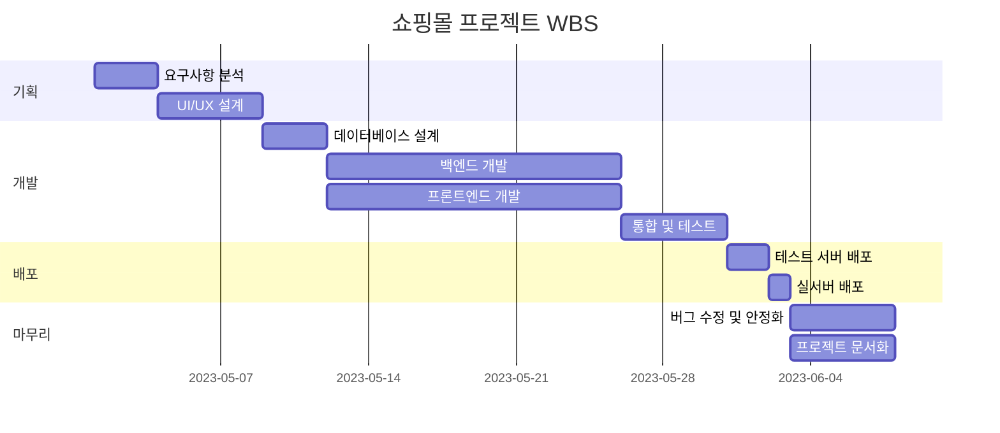

# ormi-facebook

## 프로젝트 목표
- 오르미 친목도모 SNS
- 각자의 TIL(Today I Learned) 공유

## 개발환경
- 깃헙
- 테스트 계정

## 개발일정

```mermaid
gantt
    title 쇼핑몰 프로젝트 WBS
    dateFormat  YYYY-MM-DD
    section 기획
    요구사항 분석           :a1, 2023-05-01, 3d
    UI/UX 설계            :a2, after a1, 5d
    section 개발
    데이터베이스 설계         :b1, after a2, 3d
    백엔드 개발            :b2, after b1, 14d
    프론트엔드 개발          :b3, after b1, 14d
    통합 및 테스트          :b4, after b2, 5d
    section 배포
    테스트 서버 배포         :c1, after b4, 2d
    실서버 배포            :c2, after c1, 1d
    section 마무리
    버그 수정 및 안정화       :d1, after c2, 5d
    프로젝트 문서화          :d2, after c2, 5d
```